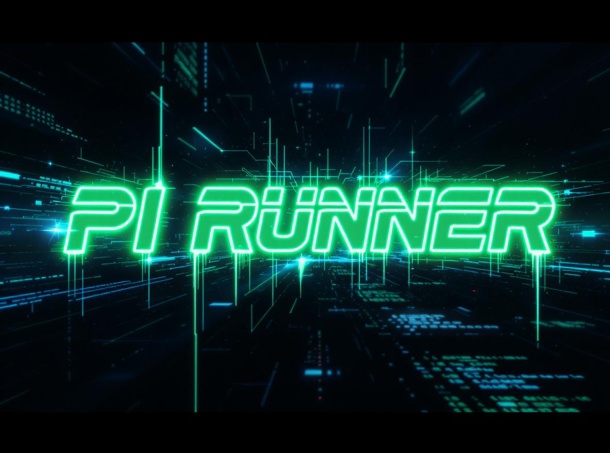

# PI Runner

A Windows shellcode loader for authorized penetration tests and red team operations. PI Runner combines natural language payload encoding with computational sandbox evasion to execute shellcode while reducing static and behavioral detection opportunities.

PI Runner is designed to work with [Jargon](https://github.com/RedSiege/jargon) by [Mike Saunders](https://redsiege.com/about-us/meet-the-team/) of [Red Siege](https://redsiege.com/), which handles encoding raw shellcode as natural language word arrays before it is embedded in the loader.

---


## How It Works

PI Runner layers several techniques at different stages of execution:

### 1. Natural Language Payload Encoding

Rather than encoding shellcode with traditional methods (XOR, AES, Base64, etc.) that are well-known to AV and EDR signature engines, PI Runner uses Jargon to replace each shellcode byte with a word from a dictionary file. The loader embeds two arrays:

- A **translation table** — 256 words, one for each possible byte value (0x00–0xFF)
- An **encoded payload array** — the shellcode bytes represented as their corresponding words

At runtime the loader walks both arrays and reconstructs the original shellcode byte-by-byte in memory. This eliminates the recognizable byte patterns that static scanners look for.

### 2. PI Calculation Sandbox Evasion

Automated sandbox environments typically have strict execution time budgets. PI Runner performs repeated calculations of PI using the Chudnovsky algorithm (a computationally intensive series expansion) at five points across the execution flow — before decoding, before resolving NT functions, before memory allocation, before copying the payload, and after copying. The number of iterations is configurable via `PI_ITERATIONS` and `TOTAL_PI_CALCULATIONS`. A fake GUI window displaying "Calculating PI..." with a progress bar provides visual cover for this delay on a real system.

### 3. Direct NT API Calls

Rather than calling the standard Win32 `VirtualAlloc` / `VirtualProtect` functions — which are common EDR hook targets — PI Runner resolves `NtAllocateVirtualMemory` and `NtProtectVirtualMemory` directly from `ntdll.dll` at runtime using `GetModuleHandleA` and `GetProcAddress`. This bypasses userland hooks that EDRs place on the higher-level Win32 layer.

### 4. Staged Memory Permissions (RW → RX)

Memory for the shellcode is first allocated as `PAGE_READWRITE`. The decoded shellcode is copied in, then the region is flipped to `PAGE_EXECUTE_READ` before execution. Allocating memory as `PAGE_EXECUTE_READWRITE` (RWX) in a single step is a well-known behavioral indicator; the two-step approach avoids it.

### 5. Detached Execution

The shellcode runs in its own thread, detached from the loader. Once execution begins the GUI closes and the window disappears. The host process stays alive in a sleep loop so the shellcode thread continues running independently.

---

## Prerequisites

- **Windows** with [MSVC](https://visualstudio.microsoft.com/visual-cpp-build-tools/) (Visual Studio Build Tools or full Visual Studio install)
- **Python 3** for running Jargon
- Raw shellcode `.bin` output from a C2 framework (Cobalt Strike, Havoc, etc.)

---

## Workflow

### Step 1 — Generate Shellcode

Export a raw shellcode `.bin` from your C2 framework of choice. For example, in Cobalt Strike use **Attacks → Packages → Payload Generator** and select **Raw**. In Havoc, export a shellcode binary from the payload builder.

### Step 2 — Encode with Jargon

Run `jargon.py` against the `.bin` file, pointing it at the included `cats.txt` dictionary (or any dictionary with at least 256 unique words):

```
python3 jargon.py -i payload.bin -d cats.txt -o payload.c
```

Jargon will output `payload.c` containing:
- `translation_table[]` — the 256-word lookup table
- `translated_shellcode[]` — the payload encoded as words
- A scaffold decode loop

### Step 3 — Populate pi_runner.c

Open the generated `payload.c` and copy only the array contents (the values between `{ }`) into the matching placeholders in `pi_runner.c` — do not copy the variable declarations from `payload.c`, only the contents:

1. **Shellcode length** — set `DEVcode_LEN` to the number of entries in `translated_shellcode[]`
2. **Translation table** — copy the contents between `{ }` from `translation_table[]` in `payload.c` into the `translation_table[256]` placeholder in `pi_runner.c`
3. **Encoded payload** — copy the contents between `{ }` from `translated_shellcode[]` in `payload.c` into the `encoded_DEVcode[DEVcode_LEN]` placeholder in `pi_runner.c`

The three placeholders in `pi_runner.c` are clearly marked:

```c
#define DEVcode_LEN <SIZE OF SHELLCODE IN BYTES FROM JARGON OUTPUT>

const char* translation_table[256] = { <JARGON TRANSLATION TABLE GOES HERE> };

const char* encoded_DEVcode[DEVcode_LEN] = { <JARGONIZED SHELLCODE GOES HERE> };
```

### Step 4 — Tune Timing (Optional)

Adjust the two `#define` values at the top of `pi_runner.c` to control how long the PI calculation stages run. Higher values increase the sandbox evasion delay; lower values speed up execution on a real target.

```c
#define PI_ITERATIONS 6000       // iterations per PI calculation call
#define TOTAL_PI_CALCULATIONS 6000  // number of calculation calls per stage
```

### Step 5 — Compile

Use the MSVC compiler from a Developer Command Prompt:

```
cl /Od pi_runner.c /Fe:pi_runner.exe /link /SUBSYSTEM:WINDOWS user32.lib gdi32.lib
```

| Flag | Purpose |
|------|---------|
| `/Od` | Disables compiler optimizations (preserves timing behavior) |
| `/Fe:pi_runner.exe` | Names the output executable |
| `/SUBSYSTEM:WINDOWS` | Produces a GUI application (no console window) |
| `user32.lib gdi32.lib` | Links the Windows UI libraries needed for the progress bar window |

---

## File Overview

| File | Description |
|------|-------------|
| `pi_runner.c` | Shellcode loader — populate with Jargon output then compile |
| `jargon.py` | Encodes a raw shellcode `.bin` into a natural language C array |
| `cats.txt` | Cat-themed word dictionary for Jargon (260 unique words) |

---


---

## Credits

- **Jargon** — natural language shellcode encoding tool by [Mike Saunders](https://redsiege.com/about-us/meet-the-team/) / [Red Siege](https://github.com/RedSiege/jargon)

---

## Disclaimer

PI Runner is intended for use in **authorized penetration testing and red team engagements only**. Using this tool against systems or networks without explicit written permission is illegal and unethical. The author assumes no liability for unauthorized or malicious use.
